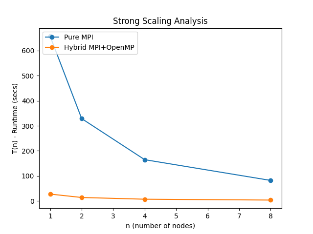

# Project 4 - N Body Problem

# Milestone 1 - Serial CPU Implementation (with OpenMP)
## Local System Information:
### Processor:

```
Chip:               Apple M1 Pro
Number of Cores:	8 (6 performance and 2 efficiency)
```

### Compiler:

```
Compiler:           GNU C++ compiler - g++
Version:            11
```

# Milestone 1 - Serial CPU Implementation (with OpenMP)

The purpose of this portion of the project is to develop a serial, cpu-based algorithm for simulating the n-body problem. 

## Run Instructions:
To run the n-body algorithm written in `C++`, follow these steps.

1. Enter the correct directory - 
```
cd milestone-1
```

2. Specify the input `n` **(number of bodies)**, `dt` **(timestep)**, `N` **(number of timesteps)**, the `initialization` **(initialization type for the bodies)** and `num_threads` **(number of OpenMP threads)** in the Makefile.

3. Build and run - 
```
make
```

This will generate the executable, run the code for the inputs specified in the Makefile, and generate the plot for the render.

4. Clean the temporary files - 
```
make clean_text
make clean_png
```

The outputs can be found in the `milestone-1/output` directory as `movie.mp4`.

## Results:

### Inputs - 
```
1. n (number of bodies) = 102,400
2. dt (timestep) = 0.01
3. N (number of timesteps) = 500
4. num_threads (number of OpenMP threads) = 1 (For serial testing)
5. initialization = "random"
```

### Time Taken - 

```
Time Taken = 17.367750 seconds per iteration.
```

### Inputs - 
```
1. n (number of bodies) = 1000
2. dt (timestep) = 0.01
3. N (number of timesteps) = 1000
4. num_threads (number of OpenMP threads) = 8
5. initialization = "elipsoid"
```

### Animation Results - 

The animation of the simulation with the above input parameters can be found [here](https://drive.google.com/drive/folders/1OTozCm7gYgTSGpDCiIvXJGXIhaZS_DjR) under `serial.mp4`.

### Strong Scaling (OpenMP) - 

Verification of correctness - 

I tried the experiment with 2 bodies, computed the force after 1 iteration and checked my output text file against the manually computed results. Since they matched, I verified correctness in this way (quantitatively). For qualitative vertification of correctness, one can view the output animation between the serial and parallel (shared memory parallelism) versions which can be found [here](https://drive.google.com/drive/folders/1OTozCm7gYgTSGpDCiIvXJGXIhaZS_DjR) under `serial.mp4` and `parallel_omp.mp4` respectively.

The inputs for qualitative verification are given below - 
```
1. n (number of bodies) = 1000
2. dt (timestep) = 0.01
3. N (number of timesteps) = 1000
4. num_threads (number of OpenMP threads) = 1 (serial) and 8 (OpenMP Shared Memory Parallelism)
5. initialization = "elipsoid"
```


Strong Scaling for Shared Memory Parallelism - 

Given below is the data for and a plot of strong scaling as a function of OpenMP thread count.

| Cores       | time (secs/iter)    |
| ----------- | ----------- |
| 1           | 17.3392     |
| 2           | 8.9305     |
| 4           | 4.5864     |
| 6           | 3.1169     |
| 8           | 2.8383     |


OpenMP strong scaling appears to be quite good. I expect this to be this way as we have several loops that can be multithreaded with OpenMP.


# Final Version - Parallel Dsitributed-CPU Implementation (Hyprid MPI + OpenMP)

This is a **hybrid** `OpenMP` + `MPI` implementation of the `n-body` particle interaction problem. MPI provides support for message passing between different node region where each node contains CPUs that can be threaded. This multithreading is where the OpenMP comes in. The former allows for distributed memory computing while the latter enables shared memeory parallelism. 

## System Information:

```
All strong scaling is done on the caslake partition of midway 3. 
```

## Run Instructions:

To run the `n body` particle interaction algorithm written in `C++`, follow these steps.

1. Enter the correct directory - 
```
cd final-version
```

2. Specify the the inputs as shown in previous sections, in the Makefile.

3. Specify the number of MPI ranks in the Makefile (the variable is called **NODES**).

4. Build and run -
MPI does not properly link on my local system, therefore, I pass the locations of the files to include and link in my Makefile. 

- Therefore, you can change the path to the files to include and link in the Makefile and run the following - 
```
make
```

**OR**

- You can use the batch file I have written called **batch_file** in the following way (this uses mpic++ and is what I use on midway3 to compile, instead of g++-11 which I used on my local system to compile MPI code).

The outputs can be found in the **final-version/output** directory.

Note:

To generate the output animation, `ffmpeg` must be installed as this will convert the generate `avi` movie into an `mp4` movie, thereby saving a lot of space. If you have a player such as `VLC`, you will be able to view the animation in its `avi` format as well.

## Distributed Memory Parallelism (MPI) - Demonstrating Correctness:

We can show correctness by comparing the outputs of the hybrid implementation with the serial implementation of the algorithm for simulation. The outputs are **close** in value. Furthermore, the output can be seen to be qualitatively evaluated as the correct output when comparing the hybrid implementation output and serial output found [here](https://drive.google.com/drive/folders/1OTozCm7gYgTSGpDCiIvXJGXIhaZS_DjR) under `hybrid.mp4` and `serial.mp4` respectively.


## Strong Scaling on Midway 3:

Inputs for analysis - 
```
1. n (number of bodies) = 102400
2. dt (timestep) = 0.01
3. N (number of timesteps) = 10
4. initialization = "elipsoid"
```

### Pure MPI - 

```
MPI ranks per node = 24
Threads per rank = 1
```

| Nodes       | time (secs)    |
| ----------- | ----------- |
| 1           | 657.2141     |
| 2           | 328.7498     |
| 4           | 164.802     |
| 8           | 81.9527    |

### Hybrid MPI + OpenMP - 

```
MPI ranks per node = 1
Threads per rank = 24
```

| Nodes       | time (secs/iter)    |
| ----------- | ----------- |
| 1           | 27.4820     |
| 2           | 13.8322     |
| 4           | 6.9990     |
| 8           | 3.5570     |


### Plot - 

Note - 

We are performing strong scaling analysis where the y-axis represents the runtime rather than the speedup. This means that we expect to see a negative slope on the line as the number of nodes increase i.e. the runtime reduces as the number of nodes used increases.



Comparison between pure MPI and hybrid MPI + OpenMP implementations - 

The hybrid implementation appears to have a far better runtime and scaling than the pure MPI implementation. I believe that this is because, for the problem size provided and the algorithm we are implementation, given the number of loops that can be multithreaded with OpenMP, there is far better parallelism achieved in the hybrid model. Furthermore, another reason for the better performance by the hybrid implementation is that there may not be as much memory contention for MPI alleviate. This can explain why the pure MPI implementation does well in the strong scaling plot, however, not as well as the hybrid MPI + OpenMP implementation.


## Production Simulation - 

You can find a production simulation [here](https://drive.google.com/drive/folders/1OTozCm7gYgTSGpDCiIvXJGXIhaZS_DjR) under `production.mp4`. The input parameters used are as follows - 
```
1. n (number of bodies) = 1048576
2. dt (timestep) = 0.01
3. N (number of timesteps) = 400
4. initialization = "elipsoid"
```
## Just for fun - 

You can find a simulation I made testing out different parameters [here](https://drive.google.com/drive/folders/1OTozCm7gYgTSGpDCiIvXJGXIhaZS_DjR) under `fun.mp4`. You can explore different initializations I have tried - 

- random
- uniform
- elipsoid
- galaxy

You can also change the type of plot between the following - 

- point
- surface

All of these parameters can be set in the Makefile provided.