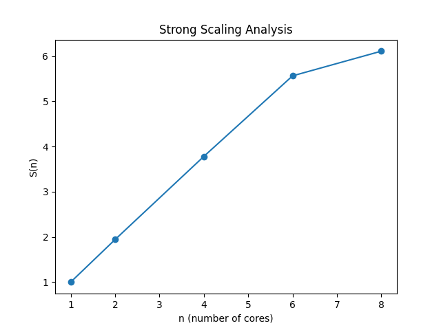

# Project 4 - N Body Problem

# Milestone 1 - Serial CPU Implementation (with OpenMP)
## Local System Information:
### Processor:

```
Chip:               Apple M1 Pro
Number of Cores:	8 (6 performance and 2 efficiency)
```

### Compiler:

```
Compiler:           GNU C++ compiler - g++
Version:            11
```

# Milestone 1 - Serial CPU Implementation (with OpenMP)

The purpose of this portion of the project is to develop a serial, cpu-based algorithm for simulating the n-body problem. 

## Run Instructions:
To run the n-body algorithm written in `C++`, follow these steps.

1. Enter the correct directory - 
```
cd milestone-1
```

2. Specify the input `n` **(number of bodies)**, `dt` **(timestep)**, `N` **(number of timesteps)**, the `initialization` **(initialization type for the bodies)** and `num_threads` **(number of OpenMP threads)** in the Makefile.

3. Build and run - 
```
make
```

This will generate the executable, run the code for the inputs specified in the Makefile, and generate the plot for the render.

4. Clean the temporary files - 
```
make clean_text
make clean_png
```

The outputs can be found in the `milestone-1/output` directory as `movie.mp4`.

## Results:

### Inputs - 
```
1. n (number of bodies) = 102,400
2. dt (timestep) = 0.01
3. N (number of timesteps) = 500
4. num_threads (number of OpenMP threads) = 1 (For serial testing)
5. initialization = "random"
```

### Time Taken - 

```
Time Taken = 17.367750 seconds per iteration.
```

### Inputs - 
```
1. n (number of bodies) = 1000
2. dt (timestep) = 0.01
3. N (number of timesteps) = 1000
4. num_threads (number of OpenMP threads) = 8
5. initialization = "elipsoid"
```

### Animation Results - 

The animation of the simulation with the above input parameters can be found [here](https://drive.google.com/drive/folders/1OTozCm7gYgTSGpDCiIvXJGXIhaZS_DjR) under `serial.mp4`.

### Strong Scaling (OpenMP) - 

Verification of correctness - 

I tried the experiment with 2 bodies, computed the force after 1 iteration and checked my output text file against the manually computed results. Since they matched, I verified correctness in this way (quantitatively). For qualitative vertification of correctness, one can view the output animation between the serial and parallel (shared memory parallelism) versions which can be found [here](https://drive.google.com/drive/folders/1OTozCm7gYgTSGpDCiIvXJGXIhaZS_DjR) under `serial.mp4` and `parallel_omp.mp4` respectively.

The inputs for qualitative verification are given below - 
```
1. n (number of bodies) = 1000
2. dt (timestep) = 0.01
3. N (number of timesteps) = 1000
4. num_threads (number of OpenMP threads) = 1 (serial) and 8 (OpenMP Shared Memory Parallelism)
5. initialization = "elipsoid"
```


Strong Scaling for Shared Memory Parallelism - 

Given below is the data for and a plot of strong scaling as a function of OpenMP thread count.

| Cores       | time (secs/iter)    |
| ----------- | ----------- |
| 1           | 17.3392     |
| 2           | 8.9305     |
| 4           | 4.5864     |
| 6           | 3.1169     |
| 8           | 2.8383     |



